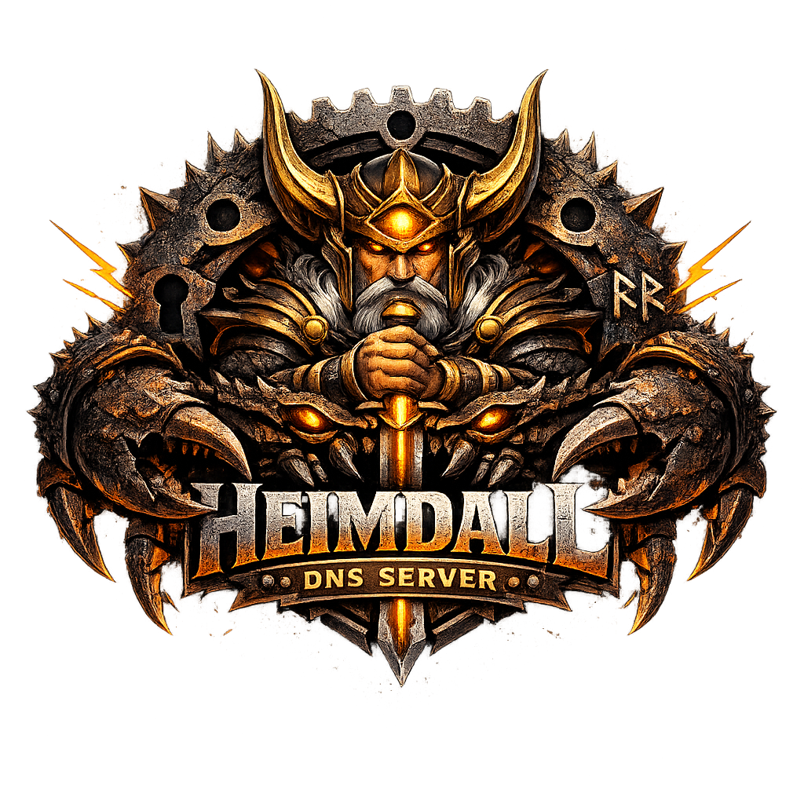

<div align="center">
  

  <h1>Heimdall</h1>
  <p><strong>A high-performance, security-first DNS server written in Rust.</strong><br>
  Authoritative, recursive, and forwarding roles in a single binary, with first-class support for DoT, DoH, and DoQ.</p>

  [](https://github.com/FlavioCFOliveira/Heimdall/actions/workflows/ci-tier1.yml)
  [](https://github.com/FlavioCFOliveira/Heimdall/releases/latest)
  [](LICENSE)
  [](rust-toolchain.toml)
  [](SECURITY.md)
  [](specification/012-runtime-operations.md)
</div>

---

## Table of contents

- [What is Heimdall?](#what-is-heimdall)
- [At a glance](#at-a-glance)
- [Status and maturity](#status-and-maturity)
- [Quickstart](#quickstart)
- [Server roles](#server-roles)
- [Transports](#transports)
- [Security model](#security-model)
- [Observability](#observability)
- [Configuration](#configuration)
- [Deployment](#deployment)
- [Performance](#performance)
- [Building from source](#building-from-source)
- [Documentation map](#documentation-map)
- [Comparison with other DNS servers](#comparison-with-other-dns-servers)
- [Frequently asked questions](#frequently-asked-questions)
- [Contributing](#contributing)
- [License and security](#license-and-security)

---

## What is Heimdall?

Heimdall is an open-source DNS server written from scratch in **Rust**, designed for environments of extremely high load and concurrency where neither performance nor security can be compromised. A single Heimdall process can serve any combination of three DNS roles — **authoritative**, **recursive (validating) resolver**, and **forwarder** — over any of the modern DNS transports: classic DNS-over-UDP/53 and DNS-over-TCP/53, **DNS-over-TLS (DoT, RFC 7858)**, **DNS-over-HTTPS (DoH/H2 and DoH/H3, RFC 8484)**, and **DNS-over-QUIC (DoQ, RFC 9250)**.

Use Heimdall when you need:

- A modern, memory-safe DNS server suitable for **high-QPS public resolvers**, **encrypted DNS gateways**, **enterprise authoritative deployments**, or **on-prem forwarders**.
- **DNSSEC validation by default** with hardening against KeyTrap (CVE-2023-50387) and NSEC3-iteration amplification (RFC 9276), and aggressive use of NSEC/NSEC3 (RFC 8198).
- A **single binary** that can replace a stack of separate authoritative + recursive + forwarder daemons, with one configuration model and one observability surface.
- **Transparent operations**: SIGHUP atomic reloads with no in-flight query loss, OpenMetrics-formatted metrics on `/metrics`, an HMAC-chained admin audit log, and a JSON-over-Unix-socket admin-RPC surface for live mutations.
- A **deployment-ready story** out of the box: distroless multi-arch OCI images, signed `.tar.gz` / `.deb` / `.rpm` artefacts, SBOM (CycloneDX) per release, reproducible build verification, and reference systemd / OpenBSD `rc.d` / macOS sandbox profiles.

---

## At a glance

| Area | What Heimdall provides |
|------|------------------------|
| **Server roles** | Authoritative, recursive (DNSSEC-validating), forwarder — any combination, single process |
| **Transports** | DNS over UDP/53, TCP/53, DoT (853), DoH/H2 (RFC 8484), DoH/H3 (RFC 8484 + 9114), DoQ (RFC 9250) |
| **DNSSEC** | Validation by default; aggressive NSEC/NSEC3 (RFC 8198); KeyTrap and NSEC3-iter caps; pre-signed authoritative zones |
| **Zone transfers** | AXFR (RFC 5936), IXFR (RFC 1995), NOTIFY (RFC 1996), TSIG (RFC 8945), XoT (RFC 9103), SIG(0) optional |
| **Admission pipeline** | Five-stage: ACL → connection limits → DNS-Cookie/load gate → RRL (RFC 8906) → per-client rate limiter |
| **TLS / QUIC policy** | TLS 1.3 only, no 0-RTT, RFC 5280/6125/9525 strict validation, optional mTLS, optional SPKI pinning, QUIC v1/v2 only |
| **RPZ** | Response Policy Zones on the recursive role: NXDOMAIN, NODATA, PASSTHRU, DROP, TCP-only, Local-data, CNAME redirect |
| **Observability** | `/healthz`, `/readyz`, `/metrics` (OpenMetrics), `/version`; Prometheus-compatible; HMAC-SHA256 audit log |
| **Runtime control** | SIGHUP atomic full reload; admin-RPC over Unix domain socket; `sd_notify` + `WATCHDOG_USEC` integration |
| **Persistence** | Redis 7.0+ (UDS preferred, TLS for TCP); HSET per zone, `SET … EX` per cache entry |
| **Process hardening** | Privilege drop to unprivileged user, `CAP_NET_BIND_SERVICE` only, seccomp-bpf, systemd hardening directives |
| **Distribution** | OCI image (ghcr.io, multi-arch x86_64/arm64/riscv64), `.tar.gz` (musl-static), `.deb`, `.rpm`, `cargo install` |
| **Supply-chain** | Cosign keyless signatures, CycloneDX SBOM attestation, reproducible builds, SLSA provenance, `cargo-deny`/`audit`/`vet` |

---

## Status and maturity

| Item | Value |
|------|-------|
| **Latest release** | [v1.1.0](docs/release-notes/v1.1.0.md) — first functional General Availability build (2026-05-05) |
| **License** | MIT (see [`LICENSE`](LICENSE)) |
| **Minimum Supported Rust Version** | 1.94.0 (Rust Edition 2024) |
| **Production OS targets** | Linux 6.1+ LTS (first-class), FreeBSD and OpenBSD (best-effort) |
| **Production architectures** | `x86_64`, `aarch64`, `riscv64` on Linux |
| **Development-only** | macOS (`x86_64`, `aarch64`) — must build and pass tests, not for production |
| **Out of scope** | Windows; 32-bit / big-endian targets; `riscv64` on BSD/macOS |
| **Versioning** | [Semantic Versioning 2.0.0](https://semver.org/spec/v2.0.0.html); Conventional Commits |
| **Branching model** | [GitHub Flow](https://docs.github.com/en/get-started/using-github/github-flow) |

### Known limitations in v1.1.0

- External third-party security audit sign-off is pending publication.
- SLSA provenance hash binding is implemented but currently a stub for some artefact types ([ENG-080](specification/010-engineering-policies.md)).
- `crates.io` publication of library crates is part of the v1.1.0 release pipeline.

---

## Quickstart

Two paths are supported: **container** (recommended for evaluation) and **build from source** (required for development or unsupported platforms).

### Path A — Container (OCI, multi-arch)

The release pipeline publishes signed, distroless, multi-arch images (`linux/amd64`, `linux/arm64`, `linux/riscv64`) to GitHub Container Registry:

```text
docker pull ghcr.io/flaviocfoliveira/heimdall:v1.1.0
```

Run a recursive resolver on the host loopback, fronted by a Redis instance for persistence:

```bash
# 1. Start Redis (Heimdall's mandatory persistence backend).
docker run -d --name heimdall-redis --network host \
  redis:7-alpine

# 2. Drop a minimal config on disk (see "Path B — minimal configuration" below).
mkdir -p /etc/heimdall
cat > /etc/heimdall/heimdall.toml <<'TOML'
[roles]
recursive = true

[[listeners]]
address   = "127.0.0.1"
port      = 5353
transport = "udp"

[[listeners]]
address   = "127.0.0.1"
port      = 5353
transport = "tcp"
TOML

# 3. Run Heimdall.
docker run -d --name heimdall --network host \
  -v /etc/heimdall:/etc/heimdall:ro \
  ghcr.io/flaviocfoliveira/heimdall:v1.1.0 \
  start --config /etc/heimdall/heimdall.toml
```

The provided [`contrib/docker-compose.yml`](contrib/docker-compose.yml) starts the full developer stack — authoritative + recursive + forwarder + Redis + Prometheus + Grafana — with one command:

```text
docker compose -f contrib/docker-compose.yml up -d
```

### Path B — Build from source

Requires Rust 1.94.0 (the workspace pins the toolchain via [`rust-toolchain.toml`](rust-toolchain.toml)).

```text
cargo build --release -p heimdall
```

The binary is produced at `target/release/heimdall`. To install into `~/.cargo/bin/`:

```text
cargo install --path crates/heimdall
```

#### Minimal configuration — recursive resolver

Create `/etc/heimdall/heimdall.toml`:

```toml
# Recursive validating resolver listening on UDP and TCP.
[roles]
recursive = true

[[listeners]]
address   = "127.0.0.1"
port      = 5353
transport = "udp"

[[listeners]]
address   = "127.0.0.1"
port      = 5353
transport = "tcp"

[cache]
capacity     = 100000
min_ttl_secs = 1
max_ttl_secs = 3600
```

The HTTP observability endpoint binds to `127.0.0.1:9090` by default. The admin-RPC listener is **opt-in** — set `[admin].uds_path` to bind a Unix domain socket (mode `0600`), or configure `[admin].admin_port` together with `tls_cert` / `tls_key` to enable the optional mTLS-protected TCP endpoint (default port `9443` when configured). See [`docs/configuration-reference.md`](docs/configuration-reference.md) for the full per-key reference.

#### Validate the configuration

```text
heimdall check-config --config /etc/heimdall/heimdall.toml
```

`check-config` performs a deep validation: TOML parse, semantic validation (rejects unknown keys), Redis reachability probe, zone-load dry run, and listener bind dry run.

| Exit code | Meaning |
|-----------|---------|
| `0` | Configuration is valid; all dry-runs succeeded. |
| `2` | Validation failed. Error written to `stderr`. |
| `64` | Bad CLI usage (per `sysexits.h` `EX_USAGE`). |

#### Start the server

```text
heimdall start --config /etc/heimdall/heimdall.toml
```

The 18-phase boot sequence is specified in [`specification/015-binary-contract.md`](specification/015-binary-contract.md) and includes: privilege drop to a non-root user, `RLIMIT_NOFILE` raised to 1 048 576, Tokio multi-threaded runtime (with `io_uring` on Linux when available, `epoll` fallback, `kqueue` on BSD/macOS), Redis pool bootstrap (fail-closed), listener bind, admin-RPC bind, observability HTTP bind, and finally `sd_notify(READY=1)` when the server is ready to serve queries.

#### Verify it is running

```text
dig @127.0.0.1 -p 5353 example.com A
```

Or query an encrypted transport with `kdig`:

```text
kdig +tls @127.0.0.1 -p 853 example.com A
kdig +https @127.0.0.1 example.com A
kdig +quic  @127.0.0.1 example.com A
```

Inspect liveness, readiness, metrics, and build metadata:

```text
curl http://127.0.0.1:9090/healthz
curl http://127.0.0.1:9090/readyz
curl http://127.0.0.1:9090/metrics
curl http://127.0.0.1:9090/version
```

#### Reload configuration without downtime

```text
kill -HUP $(pidof heimdall)
```

Heimdall performs an **atomic swap** of the running state behind a single `ArcSwap` pointer: in-flight queries continue against the old configuration, new queries see the new configuration, and listeners are not torn down. Any parse or validation failure is rejected as a whole — the previously running state is preserved.

#### Graceful drain and stop

```text
kill -TERM $(pidof heimdall)
```

`SIGTERM` (or `SIGINT`) triggers a coordinated drain: new connections are refused, in-flight queries are given up to `drain_grace_secs` (default `30`) to complete, and the process exits cleanly. `sd_notify(STOPPING=1)` is emitted at the start of drain.

---

## Server roles

A single Heimdall process supports any combination of the three roles. Roles are activated explicitly under `[roles]`; only roles set to `true` are instantiated, and a configuration with all three disabled is structurally rejected at load.

### Authoritative

Serves **pre-signed** DNSSEC zones (no online signing, no private-key material in the process). Supports the full zone-transfer ecosystem: AXFR (RFC 5936), IXFR (RFC 1995), NOTIFY (RFC 1996), TSIG (RFC 8945, with SHA-256 required and SHA-1/-384/-512 supported), SIG(0), and XoT (RFC 9103).

```toml
[roles]
authoritative = true

[[listeners]]
address   = "0.0.0.0"
port      = 53
transport = "udp"

[[listeners]]
address   = "0.0.0.0"
port      = 53
transport = "tcp"

[zones]
[[zones.zone_files]]
origin = "example.com."
path   = "/etc/heimdall/zones/example.com.zone"
```

A complete annotated example lives at [`contrib/heimdall-auth.toml`](contrib/heimdall-auth.toml).

### Recursive (validating)

Iterative recursion from the root, with **DNSSEC validation enabled by default** and the following hardening on by default:

- **Aggressive NSEC/NSEC3** (RFC 8198): synthesises `NXDOMAIN` and `NODATA` responses locally from `secure`-validated proofs.
- **KeyTrap mitigation** (CVE-2023-50387): cap on `DNSKEY` × `RRSIG` combinations per RRset.
- **NSEC3 iteration cap** (RFC 9276): 150 iterations maximum, with `insecure` outcome above the cap.
- **QNAME minimisation** (RFC 9156): relaxed mode by default; strict mode available.
- **0x20 case randomisation** with case-match verification, per-server adaptive disable, periodic re-probe.
- **Negative Trust Anchors** with mandatory expiry, manageable via the admin-RPC surface.

```toml
[roles]
recursive = true

[[listeners]]
address   = "0.0.0.0"
port      = 53
transport = "udp"

[[listeners]]
address   = "0.0.0.0"
port      = 53
transport = "tcp"

[cache]
capacity     = 1_000_000
min_ttl_secs = 1
max_ttl_secs = 86_400
```

### Forwarder

Forwards queries to one or more upstream resolvers, with per-zone matching and per-rule fallback. Supports all five transports for outbound traffic (UDP, TCP, DoT, DoH, DoQ) and propagates upstream RCODEs transparently. EDNS Client Subnet is **stripped and not forwarded** (consistent with RFC 9558 / BCP 237).

```toml
[roles]
forwarder = true

[[listeners]]
address   = "0.0.0.0"
port      = 53
transport = "udp"

[[forward_zones]]
match = "."

[[forward_zones.upstreams]]
address   = "1.1.1.1"
port      = 853
transport = "dot"

[[forward_zones.upstreams]]
address   = "9.9.9.9"
port      = 853
transport = "dot"
```

The forward-zone matching algorithm, precedence rules, fallback policy, and load-balancing strategies are specified in [`specification/014-forward-zones.md`](specification/014-forward-zones.md).

---

## Transports

| Transport | Default port | Specification | Server-side | Client-side (forwarder upstream / recursive ADoT) |
|-----------|:-----------:|---------------|:----------:|:---:|
| DNS over UDP | `53` | RFC 1035 | yes | yes |
| DNS over TCP | `53` | RFC 1035, 7766 | yes | yes |
| DNS over TLS (DoT) | `853` | RFC 7858 | yes | yes |
| DNS over HTTPS / HTTP/2 (DoH) | `443` | RFC 8484 | yes | yes |
| DNS over HTTPS / HTTP/3 (DoH3) | `443` | RFC 8484, 9114 | yes | yes |
| DNS over QUIC (DoQ) | `853` | RFC 9250 | yes | yes |

**Encrypted-transport invariants** (specification [`003-crypto-policy.md`](specification/003-crypto-policy.md)):

- TLS 1.3 only — TLS 1.2 and below are refused at handshake.
- 0-RTT is disabled on every TLS-protected transport (inbound and outbound).
- Stateless TLS 1.3 session-ticket resumption with periodic TEK rotation is the sole inbound resumption mechanism.
- Optional default-OFF per-listener mTLS on TLS-over-TCP and on TLS-inside-QUIC.
- QUIC v1 + v2 only; no draft variants. Retry tokens on new flows; single-use NEW_TOKEN with anti-replay.
- HTTP/2 and HTTP/3 hardening: header-block size, stream concurrency, HPACK / QPACK dynamic-table caps, rapid-reset detection, CONTINUATION cap, control-frame rate limits.
- Outbound certificate validation: vendored Mozilla CA bundle with per-upstream `trust_anchor` override, RFC 5280 PKIX, RFC 6125 / 9525 hostname verification, optional SPKI pinning, OCSP stapling soft-fail with RFC 7633 must-staple honoured.

The recursive role's outbound **ADoT** path discovers encrypted authoritative endpoints via DNSSEC-validated `SVCB` records under `_dns.<NS>.` (`draft-ietf-dnsop-svcb-dns`) and falls back to NS-iteration on handshake failure.

---

## Security model

Security is a **non-negotiable** project principle (see [`CLAUDE.md`](CLAUDE.md)). When security and performance conflict, security prevails. The full threat model is specified in [`specification/007-threat-model.md`](specification/007-threat-model.md).

### Five-stage admission pipeline

Every inbound query is evaluated in this strict order before any DNS processing:

1. **ACL** — multi-axis matching across source IP/CIDR, mTLS client-certificate identity, TSIG key identity, transport, role, operation type, and QNAME pattern. Default-deny on AXFR / IXFR; default-deny on recursive-role and forwarder-role queries; default-allow on authoritative-role queries.
2. **Connection limits** — per-`(transport, listener)` concurrent connection cap; per-source / per-identity in-flight cap; server-wide global pending-queries cap.
3. **DNS-Cookie / load gate** — DNS Cookies (RFC 7873) bias admission toward authenticated or cookie-bearing traffic when the server is under load.
4. **Response Rate Limiting (RRL)** — RFC 8906 with `slip`-truncation behaviour, keyed on `(client-prefix, qname, qtype)` on the authoritative role.
5. **Per-client query rate limiter** — three-tier (Anonymous / ValidatedCookie / AuthenticatedIdentity) with stricter buckets for anonymous or invalid-cookie clients.

Each stage emits structured per-stage telemetry; counters are exposed at `/metrics`.

### DNSSEC validation hardening

| Mitigation | Default | Specification |
|------------|---------|---------------|
| Aggressive NSEC / NSEC3 caching (RFC 8198) | enabled, no off-switch | DNSSEC-007 |
| KeyTrap (CVE-2023-50387) — `DNSKEY` × `RRSIG` cap | enabled, no off-switch | DNSSEC-013 |
| RFC 9276 `NSEC3` iteration cap (≤ 150) | enabled, no off-switch | DNSSEC-014 |
| RFC 8624 §3.1 algorithm acceptance (8, 13 MUST; 14–16 SHOULD; 1, 3, 6, 12 forbidden) | enforced | DNSSEC-008 |
| RFC 8624 §3.2 DS digest acceptance (SHA-256 MUST, SHA-1 fallback only) | enforced | DNSSEC-015 |
| Negative Trust Anchors with mandatory expiry | operator-managed | DNSSEC-017 |

### Process hardening

Operational hardening is applied on every supported platform and is not opt-out:

- **Privilege drop** to a dedicated unprivileged user (`heimdall` by default) after socket bind; retains `CAP_NET_BIND_SERVICE` only; drops every other Linux capability.
- **seccomp-bpf** allow-list filter on Linux.
- **Filesystem isolation** via `RootDirectory=` / `chroot` / `pivot_root` / mount namespace.
- **W^X** enforcement on all mapped regions.
- **OpenBSD `pledge` / `unveil`** equivalents and a **macOS sandbox profile** shipped under [`contrib/openbsd/`](contrib/openbsd) and [`contrib/macos/`](contrib/macos).
- **Reference systemd unit** at [`contrib/systemd/`](contrib/systemd) with the full hardening directive set.

### Supply-chain integrity

- **Cosign keyless signatures** on every release artefact (OIDC-bound, GHSA-attested).
- **CycloneDX SBOM** attached to every container image and release tarball.
- **Reproducible build verification** in CI ([`.github/workflows/reproducible-build.yml`](.github/workflows/reproducible-build.yml)).
- **`cargo-deny` / `cargo-audit` / `cargo-vet`** enforced at CI Tier 1.
- **SLSA provenance** generated as part of the release pipeline.

Vulnerability reports are accepted via [GitHub Security Advisories private reporting](https://github.com/FlavioCFOliveira/Heimdall/security/advisories/new) — see [`SECURITY.md`](SECURITY.md) for the coordinated disclosure policy and response timeline.

---

## Observability

Heimdall exposes a **read-only HTTP observability surface** distinct from any DoH listener and distinct from the admin-RPC surface. By default it binds to `127.0.0.1:9090`.

| Endpoint | Purpose | Format |
|----------|---------|--------|
| `GET /healthz` | Liveness probe — always `200 OK` while the process is up | `text/plain` |
| `GET /readyz` | Readiness probe — `200 OK` when ready, `503 Service Unavailable` during drain or startup | `text/plain` |
| `GET /metrics` | OpenMetrics counters and gauges (Prometheus-compatible) with mandatory `# EOF` | `application/openmetrics-text` |
| `GET /version` | JSON: `name`, `version`, `git_hash`, `build_date`, `rustc_version`, `target_triple`, `features`, `tier`, `msrv`, `runtime` (uid/gid) | `application/json` |

A reference Grafana dashboard and Prometheus scrape configuration ship under [`contrib/grafana/`](contrib/grafana) and [`contrib/prometheus/`](contrib/prometheus).

### Structured logging

JSON-formatted log events use OpenTelemetry field conventions and are emitted on:

- DNSSEC `bogus` outcomes; KeyTrap and NSEC3-cap fires.
- HPACK / QPACK decompression-bomb detections; HTTP/2 rapid-reset; CONTINUATION-flood.
- 0x20 case mismatches classified as adversarial.
- TLS / certificate validation failures; QUIC `NEW_TOKEN` replay.
- DNS Cookie validation failures; ACL denies; rate-limit fires; resource-limit fires.
- NTA lifecycle events; QNAME minimisation fallbacks.

### Admin audit log

Every admin-RPC command is recorded in an **HMAC-SHA256 chained log**. Each entry carries a sequence number, timestamp, identity, command, outcome, and an HMAC tag computed over `(seq ‖ prev_tag ‖ identity ‖ command ‖ outcome)`. Offline integrity verification is available via `AuditLogger::verify_chain`.

---

## Configuration

Heimdall is configured via a **single TOML file** (TOML v1.0.0). The default path is `/etc/heimdall/heimdall.toml`; override with `--config <path>`.

The configuration loader uses `deny_unknown_fields`: any unknown key causes the process to refuse to start. There are no silently ignored options.

### Annotated examples

Three role-specific examples ship under [`contrib/`](contrib):

| File | Role | Listener port (dev) |
|------|------|:--------------:|
| [`contrib/heimdall-recursive.toml`](contrib/heimdall-recursive.toml) | Recursive resolver | 5354 |
| [`contrib/heimdall-auth.toml`](contrib/heimdall-auth.toml) | Authoritative server | 5353 |
| [`contrib/heimdall-forwarder.toml`](contrib/heimdall-forwarder.toml) | Forwarder | 5355 |

The exhaustive per-key reference is at [`docs/configuration-reference.md`](docs/configuration-reference.md). Top-level sections currently supported:

- `[server]` — identity and worker-thread parameters.
- `[roles]` — `authoritative`, `recursive`, `forwarder` boolean flags.
- `[[listeners]]` — array of `{ address, port, transport, … }` entries.
- `[zones]` and `[[zones.zone_files]]` — authoritative zone loading.
- `[cache]` — capacity and TTL bounds.
- `[acl]` — access-control matrix.
- `[rate_limit]` — RRL and per-client RL parameters.
- `[[rpz]]` — Response Policy Zone feeds.
- `[[forward_zones]]` and `[[forward_zones.upstreams]]` — forwarder rules.
- `[observability]` — `metrics_addr`, `metrics_port`.
- `[admin]` — admin-RPC binding.
- `[rlimit]` — OS resource limits applied at boot.
- `[redis]` — persistence-backend connection.

---

## Deployment

### Container (Docker / Podman / Kubernetes)

The published image is **distroless** (no shell, no package manager) and **multi-arch**:

```text
ghcr.io/flaviocfoliveira/heimdall:v1.1.0   # immutable tag
ghcr.io/flaviocfoliveira/heimdall:v1.1     # follows latest patch
ghcr.io/flaviocfoliveira/heimdall:v1       # follows latest minor
ghcr.io/flaviocfoliveira/heimdall:latest   # follows latest GA
```

The image ships a tiny companion binary, **`heimdall-probe`**, intended for Docker / Kubernetes health checks. It opens a TCP connection to the observability endpoint, issues `GET /healthz`, and exits `0` on HTTP 200 or `1` on any error.

```dockerfile
HEALTHCHECK --interval=10s --timeout=2s --start-period=5s --retries=3 \
  CMD ["/usr/local/bin/heimdall-probe", "127.0.0.1", "9090"]
```

The same binary works as a Kubernetes liveness probe; for readiness, query `/readyz` directly (returns `503` during drain, which lets Kubernetes route traffic away cleanly):

```yaml
livenessProbe:
  exec:
    command: ["/usr/local/bin/heimdall-probe", "127.0.0.1", "9090"]
  periodSeconds: 10
readinessProbe:
  httpGet:
    path: /readyz
    port: 9090
  periodSeconds: 5
```

The full developer stack — three Heimdall instances (one per role) plus Redis, Prometheus, and Grafana — is in [`contrib/docker-compose.yml`](contrib/docker-compose.yml).

### systemd

A reference unit file with full hardening directives ships at [`contrib/systemd/heimdall.service`](contrib/systemd/). Heimdall participates in the `sd_notify` protocol:

- `READY=1` is emitted when the boot sequence completes and listeners are accepting traffic.
- `STOPPING=1` is emitted at the start of drain.
- `WATCHDOG=1` is emitted every `WATCHDOG_USEC / 2` while the process is healthy.

### OpenBSD and macOS

A reference `rc.d` script and a macOS sandbox profile live at [`contrib/openbsd/`](contrib/openbsd) and [`contrib/macos/`](contrib/macos). macOS is **development-only**: Heimdall must build and pass tests on macOS, but it is not a supported production platform.

### Native packages

Signed `.deb` and `.rpm` packages are produced for `x86_64`, `aarch64`, and `riscv64` and install the binary together with the reference systemd unit file. See [`docs/deployment/`](docs/deployment) for per-platform installation runbooks.

---

## Performance

Heimdall's quantitative performance targets are expressed per **`(role, transport, architecture)` cell**, against three reference-hardware baselines (`x86_64` modern, `aarch64` modern, `riscv64` modern, all on Linux 6.x). The targets and measurement methodology are specified in [`specification/008-performance-targets.md`](specification/008-performance-targets.md).

The comparative ambition is:

- **Plain DNS cells (UDP/53, TCP/53)** — parity with the best-in-class reference (≈ 5 % QPS, ≈ 20 % p99) on the same architecture, with no regression on memory or CPU.
- **Encrypted-transport cells (DoT, DoH/H2, DoH/H3, DoQ)** — exceed the best-in-class reference by a measurable margin (≈ 20 % additional QPS or ≈ 80 % of reference p99).

### Running benchmarks

The `heimdall-bench` crate provides `criterion` micro-benchmarks for hot-path components (DNS message parser, cache lookup, admission pipeline, RPZ matching):

```text
cargo bench -p heimdall-bench --locked
```

End-to-end QPS / latency benchmarks via `dnsperf` / `queryperf` / `resperf` are documented under [`docs/bench/`](docs/bench) and reference baselines per architecture are stored under [`docs/bench/baselines/`](docs/bench/baselines).

CI Tier 3 nightly runs a regression gate that fails the build on any micro-benchmark that regresses by more than **5 %** versus the stored baseline for the runner's architecture (PERF-037).

---

## Building from source

### Prerequisites

- Rust **1.94.0** (pinned via [`rust-toolchain.toml`](rust-toolchain.toml)).
- A C toolchain (`cc`) and `pkg-config` for `mimalloc` / `tikv-jemallocator`.
- Optional: a Redis 7.0+ instance for runtime; tests can run against an ephemeral one.

### Build

```text
cargo build --release -p heimdall
```

### Optional features

| Crate | Feature | Default | Effect |
|-------|---------|:-------:|--------|
| `heimdall` | `mimalloc` | yes | Use [mimalloc](https://github.com/microsoft/mimalloc) as the global allocator. |
| `heimdall` | `jemalloc` | no | Use [tikv-jemallocator](https://crates.io/crates/tikv-jemallocator) as the global allocator (mutually exclusive with `mimalloc`). |
| `heimdall-runtime` | `io-uring` | no | Probe `io_uring` at runtime on Linux; fall back to `epoll` when unavailable. |

### Workspace crates

| Crate | Purpose |
|-------|---------|
| [`heimdall`](crates/heimdall) | Binary entry-point: CLI, config loading, supervisor, dependency wiring. |
| [`heimdall-core`](crates/heimdall-core) | Wire format, EDNS(0), DNSSEC primitives, core domain types. |
| [`heimdall-runtime`](crates/heimdall-runtime) | Transports, segregated caches, ACL evaluation, admission, rate limiting, observability. |
| [`heimdall-roles`](crates/heimdall-roles) | Authoritative, recursive, and forwarder role logic. |
| [`heimdall-probe`](crates/heimdall-probe) | Tiny zero-dependency HTTP healthcheck for container `HEALTHCHECK`. |
| [`heimdall-bench`](crates/heimdall-bench) | `criterion` micro-benchmarks. |
| [`heimdall-integration-tests`](crates/heimdall-integration-tests) | Cross-crate integration suite (DNSSEC vectors, conformance, soak). |
| [`heimdall-e2e-harness`](crates/heimdall-e2e-harness) | End-to-end test harness. |
| [`heimdall-ci-tools`](crates/heimdall-ci-tools) | CI utilities and gates. |

---

## Documentation map

| Document | Topic |
|----------|-------|
| [`specification/`](specification) | **Source of truth** — functional requirements, invariants, and constraints |
| [`specification/README.md`](specification/README.md) | Specification index |
| [`docs/operator-manual.md`](docs/operator-manual.md) | Operational reference for system administrators |
| [`docs/configuration-reference.md`](docs/configuration-reference.md) | Exhaustive per-key TOML reference |
| [`docs/admin-guide.md`](docs/admin-guide.md) | Admin-RPC surface and runtime control |
| [`docs/security-posture.md`](docs/security-posture.md) | Threat-model coverage and cryptographic policy |
| [`docs/troubleshooting.md`](docs/troubleshooting.md) | Symptom-driven diagnosis |
| [`docs/runbooks/`](docs/runbooks) | Per-incident runbooks |
| [`docs/deployment/`](docs/deployment) | Per-platform deployment guides (systemd, OCI, OpenBSD, macOS-dev) |
| [`docs/adr/`](docs/adr) | Architecture Decision Records (MADR 3.0+) |
| [`docs/release-notes/`](docs/release-notes) | Per-version release notes |
| [`CHANGELOG.md`](CHANGELOG.md) | Conventional-Commits-derived change log |

---

## Comparison with other DNS servers

This table summarises **structural differences** — not "we win" claims. Performance numbers are tracked per-cell against pinned reference versions in [`specification/008-performance-targets.md`](specification/008-performance-targets.md).

| Feature | Heimdall | BIND | Unbound | Knot Resolver | NSD | PowerDNS Auth | dnsdist |
|---------|:-:|:-:|:-:|:-:|:-:|:-:|:-:|
| Implementation language | Rust | C | C | C / Lua | C | C++ | C++ |
| Authoritative role | yes | yes | no | no | yes | yes | no |
| Recursive (validating) role | yes | yes | yes | yes | no | no | no |
| Forwarder role | yes | yes | yes | yes | no | no | yes |
| Single binary, multi-role | yes | yes | no | no | no | no | no |
| DoT (RFC 7858) server | yes | partial | yes | yes | no | yes | yes |
| DoH (RFC 8484) server | H2 + H3 | H2 | H2 | H2 | no | H2 | H2 |
| DoQ (RFC 9250) server | yes | no | no | yes | no | no | yes |
| Aggressive NSEC (RFC 8198) | yes | yes | yes | yes | n/a | n/a | n/a |
| KeyTrap (CVE-2023-50387) cap | yes | yes (patched) | yes (patched) | yes (patched) | n/a | n/a | n/a |
| Memory-safe by construction | yes | no | no | no | no | no | no |
| OpenMetrics endpoint | yes | partial | yes | yes | yes | yes | yes |
| Reproducible builds in CI | yes | no | no | no | no | no | no |
| Multi-arch OCI image (riscv64) | yes | no | no | no | no | no | no |

Heimdall's distinctive trade-offs:

- **Plus**: memory-safe Rust foundation, single multi-role binary, DoQ + DoH/H3 server out of the box, supply-chain integrity (cosign + SBOM + reproducible builds + SLSA) integrated into the release pipeline, modern observability surface.
- **Minus**: requires an external Redis instance for runtime persistence (mature DNS servers store everything in-process); ecosystem and operator tooling are less established than BIND / Unbound; `riscv64` is first-class but reference hardware is still maturing.

---

## Frequently asked questions

**Q. Is Heimdall production-ready?**
**A.** Heimdall reached its first functional General Availability release (v1.1.0) on 2026-05-05. The library and runtime layers, the binary entry-point, the admission pipeline, DNSSEC validation, TSIG, observability, and the soak-test suite are complete. **External third-party security audit sign-off is pending publication**; deploy with that caveat in mind.

**Q. Why Rust?**
**A.** Memory-safety by construction eliminates the entire class of vulnerabilities that has historically dominated DNS-server CVEs (use-after-free, buffer overflows, OOB reads in parsers). Rust also offers the zero-cost abstractions and async ecosystem (Tokio, hyper, rustls, quinn) needed to compete on performance with C implementations. See [`specification/007-threat-model.md`](specification/007-threat-model.md).

**Q. Why does Heimdall require Redis?**
**A.** Heimdall's persistence model (specification [`013-persistence.md`](specification/013-persistence.md)) makes Redis 7.0+ a **mandatory** runtime dependency for three data domains: authoritative zone data, the segregated query-response cache, and Response Policy Zone data. Redis provides a battle-tested storage primitive with O(1) per-RRset lookup (HGET), atomic zone replacement (RENAME on a staging key), and native per-entry TTL (`SET … EX`). The default and preferred connection mode is a Unix domain socket on the same host; TCP requires TLS on non-loopback addresses.

**Q. Can I use Heimdall as a drop-in replacement for BIND or Unbound?**
**A.** The on-the-wire DNS surface is interoperable, so DNS clients do not see a difference. However, the operator surface is intentionally different: configuration is TOML (not BIND `named.conf` or Unbound's stanza syntax), runtime control is via SIGHUP + admin-RPC + observability HTTP (not `rndc` or `unbound-control`), and persistence is in Redis (not on local disk). Existing zone files in standard RFC 1035 master format are accepted as-is.

**Q. Is DNSSEC validation mandatory?**
**A.** Validation is **enabled by default** on the recursive and forwarder roles. There is **no global off-switch** — operator overrides are limited to Negative Trust Anchors with mandatory expiry, in line with [`specification/005-dnssec-policy.md`](specification/005-dnssec-policy.md).

**Q. What CPU architectures and operating systems are supported?**
**A.** Linux on `x86_64`, `aarch64`, and `riscv64` is **first-class** (kernel 6.1+ LTS recommended, `io_uring` primary). FreeBSD and OpenBSD on `x86_64` and `aarch64` are **best-effort** (kqueue-based). macOS is **development-only**. Windows, 32-bit, and big-endian are **out of scope**.

**Q. How do I run multiple roles on the same instance?**
**A.** Set more than one flag under `[roles]`. The query-resolution precedence is fixed: (1) authoritative-zone match, (2) forward-zone rule match, (3) recursive resolver, (4) `REFUSED` with EDNS Extended DNS Error INFO-CODE 20 ("Not Authoritative"). See [`specification/001-server-roles.md`](specification/001-server-roles.md).

**Q. How do I report a security vulnerability?**
**A.** Use the [GitHub Security Advisories private reporting flow](https://github.com/FlavioCFOliveira/Heimdall/security/advisories/new). Do **not** open a public GitHub issue. Acknowledgement target is 72 hours; full coordinated-disclosure policy is in [`SECURITY.md`](SECURITY.md).

**Q. Where is the source of truth for behaviour and requirements?**
**A.** The [`specification/`](specification) folder. README, release notes, and inline documentation describe the implementation; the specification states what the implementation must do.

---

## Contributing

Contributions are welcome. The project follows:

- **[GitHub Flow](https://docs.github.com/en/get-started/using-github/github-flow)** — short-lived branches off `main`, merged via reviewed pull requests.
- **[Conventional Commits 1.0.0](https://www.conventionalcommits.org/en/v1.0.0/)** — enforced in CI Tier 1.
- **Two-reviewer baseline** for source-modifying pull requests; one-reviewer for documentation-only.
- **Code-owner approval** is required on critical paths: any path containing `unsafe`, the cryptographic surface, DNSSEC validation, parsers, the CI configuration, the release pipeline, and `cargo-deny` / `cargo-vet` / `cargo-audit` configuration.
- **MIT licence** for all contributions; an SPDX header is recommended on source files.

Local pre-flight checklist before opening a pull request:

```text
cargo fmt -- --check
cargo clippy -- -D warnings
cargo test --locked
cargo deny check
```

Full engineering policies are in [`specification/010-engineering-policies.md`](specification/010-engineering-policies.md).

---

## License and security

- **Licence**: [MIT](LICENSE).
- **Security policy**: [`SECURITY.md`](SECURITY.md).
- **Coordinated disclosure**: via [GitHub Security Advisories](https://github.com/FlavioCFOliveira/Heimdall/security/advisories/new).

---

<sub>Heimdall is named after the watchman of the Norse gods who guards the Bifröst. The project is unaffiliated with any other software bearing the same name.</sub>
